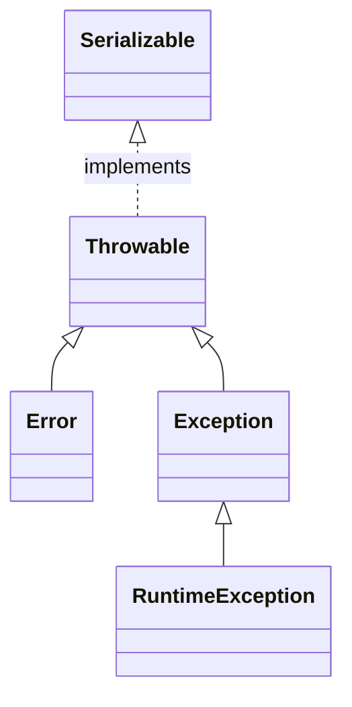

## java异常处理



- 异常分类及定位

#error 程序中出现了无法处理的错误，JVM将终止所在的线程，不受异常检查，程序员不应该实现任何新的error类型。（OutOfMemoryError：内存不足错误；StackOverflowError：栈溢出错误）

#RuntimeException 属于不受检异常，一般是由程序逻辑错误引起的，应该从逻辑上去解决并改进代码。


- 异常说明

就是在方法名的后边加上没有处理异常的说明，方便使用这个方法的程序员能够知道这些异常，并作出相应的处理。

```java
public void f() throws MyOneException, MyToException{
 /*方法体*/
}
```

方法中的异常说明可以直接写出来，方法体中可以不用直接抛出，也可以没有这个异常。这样方便后来代码的扩展作出预留的空间。

- 捕获异常

捕获异常后的使用和处理，主要体现在catch处理部分。

void printStackTrace()  主要用于打印出异常栈

getStackTrace() 主要用于获取异常栈数组，方便获取进行处理

fillInStackTrace() 重新设置异常的发生地，也可以用抛出新异常实现同样的作用

不用担心异常对象的清理，垃圾回收器会自动处理这些对象

- 异常链

Throwable initCause(Throwable cause) 

主要在抛出新异常的时候接到原来的异常链，让这些异常链能够连接上去，也可以使用异常中的构造器，构造器中的异常主要是用来接收同类的异常类型，如果是其他两种异常类型需要用initCause的方式。

- finally 关键字的作用

除内存之外的资源恢复到原来的状态，尽量不要乱用这个关键字。

如果在finally中做return操作，将会覆盖正确的返回值和抛出的异常信息。

如下，异常将会被忽略，在java8的版本中进行的测试。

```java
try {
    throw  new RuntimeException("my exception");
} finally {
    return;
}
```

- 不要在构造器中抛出异常

会让对象创建一半，而造成对象不能正确清理。

这种情况出现的异常能够处理，但是会让程序变得更加复杂，难以处理。所以不建议在构造器中抛出异常。

- 异常在继承和接口实现中也存在一些限制

只能抛出在基类方法的异常说明中列出的异常（或者是派生异常）

在覆盖基类和接口中存在同一个方法，只是异常说明不一样，那么就以基类的异常说明为准。

- 异常的特殊处理方式

在有些编程环境下，需要方法中不能吞掉异常和也不能处理异常，这个时候可以借用runtimeException把异常给吞掉，这样就可以在当前的方法中不用进行异常说明，在更高层的调用中，如果想获取异常情况，可以使用getCause()方法来获取异常信息，进而处理异常。


