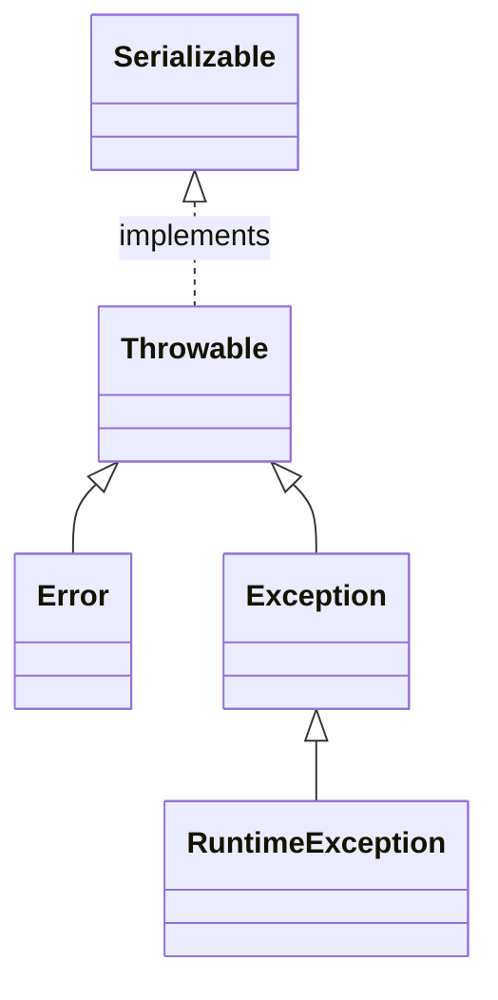

## java异常处理



- 异常说明

就是在方法名的后边加上没有处理异常的说明，方便使用这个方法的程序员能够知道这些异常，并作出相应的处理。

```java
public void f() throws MyOneException, MyToException{
 /*方法体*/
}
```

方法中的异常说明可以直接写出来，方法体中可以不用直接抛出，也可以没有这个异常。这样方便后来代码的扩展作出预留的空间。

- 捕获异常

捕获异常后的使用和处理，主要体现在catch处理部分。

void printStackTrace()  主要用于打印出异常栈

getStackTrace() 主要用于获取异常栈数组，方便获取进行处理

fillInStackTrace() 重新设置异常的发生地，也可以用抛出新异常实现同样的作用

不用担心异常对象的清理，垃圾回收器会自动处理这些对象

- 异常链


