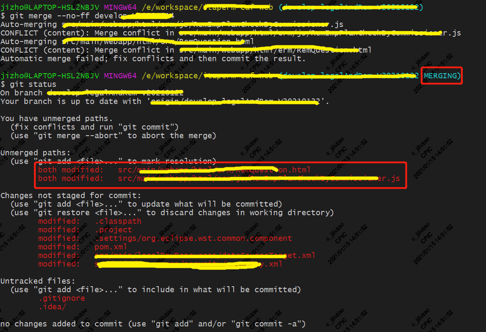

# 代码合并

## 1. 基本操作流程

​	将分支branch1合并到分支branch2

1. 查看本地分支是否有自己想要的分支

   ```shell
   #显示当前的本地分支
   git branch
   #查看本地分支与对应的跟踪分支
   git branch -vv
   
   ```
   
2. 如果本地没有要合并的分支branch2，创建本地分支并关联对应的远程分支

   ```shell
   #创建本地分支并关联对应的远程分支（跟踪分支），二选一
   git checkout -b <branch2> origin/<branch2>
   git checkout -b <branch2> --track origin/<branch2>
   ```
   
3. 切换到分支branch2，并拉取仓库中的最新代码

   ```shell
   #切换到目标分支branch2
   git checkout <branch2>
   #拉取仓库最新代码
   git pull
   ```
   
4. 进行合并代码（merge）,合并完之后查看当前的状态
   
   ```shell
   #合并代码
   git merge --no-ff <branch1>
   #查看当前的状态
   git status
   ```
   
   在执行完命令之后，一般会出现冲突，命令中出现merging中的提示，在状态中能够看到那些出现冲突的文件，如图所示
   
   


5. 解决冲突

   进入到工程中，找到冲突的文件，根据自己的需要，解决冲突，删除冲突标志，保存文件

   ```reStructuredText
   <<<<<<< HEAD
   本地分支冲突的部分
   ============
   branch1冲突的部分
   >>>>>>>> branch1
   ```

   冲突文件修改完成之后，添加冲突文件的修改，进行commit提交，

   ```shell
   #添加冲突文件的修改，add后边可以跟多个文件
   git add <filePath1>...
   
   #进行提交，message是字符串，需要添加引号
   git commit -m <message>
   
   ```
   
6. 验证代码合并是否成功，推送到远程仓库
   
   在本地开发工具中进行测试验证，如果没问题，可以将代码推送到远程仓库
   
   ```shell
   #将代码推送到对应的跟踪远程仓库
   git push
   ```
   
   

## 2. 常见问题

- 在合并过程中错误解决冲突（删除了自己想要的代码，删掉了别人的代码等等）

  - 冲突解决过程中还没有进行commit提交操作，直接拒绝合并即可

    ```shell
    #合并拒绝，终止合并
    git merge --abort
    ```
    
  - 如果已经commit，还没有进行推送（push）操作，进行reset撤销操作
  
    ```shell
    #回退到上一个提交
    git reset --hard head^
    ```
    
  - 如果已经进行了push，需要进行revert进行撤销操作
  
    ```shell
    #1.找到当时的commit提交
    git reflog
    
    #2.撤销指定commit提交
    git revert -n <commitId>
    
    #3.进行push操作
    git push
    ```
  
 - 如果在合并过程中出现了某一个commit提交给弄丢了，可以找到丢掉的commit，添加上去

   参考 [将制定的版本合并到当前分支](https://github.com/jz03/myRpository/blob/master/git%E7%9B%B8%E5%85%B3/git%E9%97%AE%E9%A2%98%E8%AE%B0%E5%BD%95.md) 中的第四条

- 如何添加beyond compare中的比较工具

  参考 [mergetool配置和使用](https://github.com/jz03/myRpository/blob/master/git%E7%9B%B8%E5%85%B3/mergetool%E9%85%8D%E7%BD%AE%E5%92%8C%E4%BD%BF%E7%94%A8.md)

  

